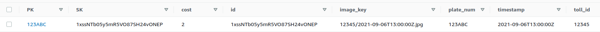

# EZToll - serverless toll system

EZToll takes pictures of license plates as input, converts them to toll events, and manages them through a REST API.

## Service Requirements
1. Highly available
1. Scales with use to handle peak traffic hours
1. Serverless, pay per use
1. Durable, store events if processing fails
1. Store logs for easy auditing


## Service Flow

1. Images of license plates are uploaded to an S3 bucket under the key format of `{id}/{timestamp}` where `id` is the id of the toll booth and `timestamp` is the timestamp of when the image was taken.
1. This image triggers and S3 event which is stored in an SQS queue for durability until processesed.
1. The Lambda function extracts text information using Rekognition and uses another service to get current toll costs.
1. This information is uploaded to a DynamoDB table which holds toll even information.
1. Toll events can be queried by license plate number.
1. A toll can be resolved by sending a payment id for each toll event id. Payments are stored in an SQS queue for durability until processed.


## Example
The following license plate image is uploaded as `12345/2021-09-06T13:00:00Z.jpg`. This specifies `12345` as the id of the toll both and `2021-09-06T13:00:00Z.jpg` as the timestamp of the image.


 
This gets processed through Amazon Rekognition and inserted into DynamoDB as the following item.




Then, the REST API can be queried like `endpoint/tolls/ABC123`, where `ABC123` is the license plate number, and receive a list of tolls for that license plate.

```json
{
    "tolls": [
        {
            "id": "1xssNTb05y5mR5VO87SH24vONEP",
            "timestamp": "2021-09-06T13:00:00Z",
            "plateNumber": "123ABC",
            "tollId": "12345",
            "paymentId": "",
            "cost": 2
        }
    ]
}
```

### TODO
- [x] return useful error messages for APIG endpoints/lambdas
- [x] for stream processing, only return single message on failure. log reason for failure
- [ ] create toll client to modularize dynamodb table interaction